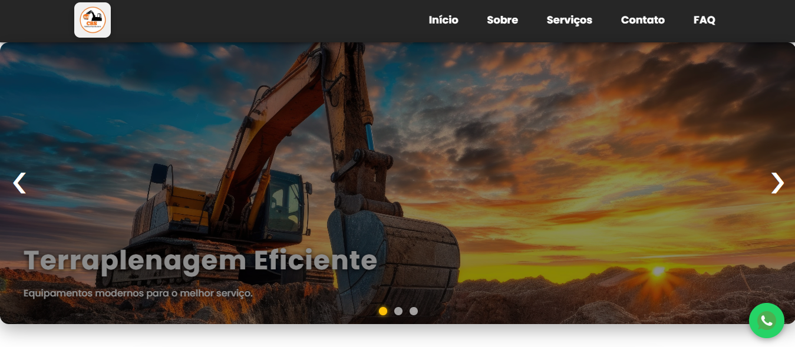
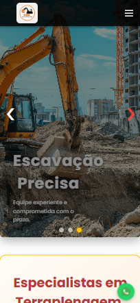

# 🚜 CBS Terraplenagem - Site Institucional

Este é o site estático desenvolvido para apresentar a empresa **CBS Terraplenagem**.

---

## 🌐 Demo

Confira o site no ar:  
[https://cbsterraplenagem.com.br/home](https://cbsterraplenagem.com.br/home)

---

## 👩‍💻 Meu papel

Desenvolvedora front-end, responsável por criar o site usando **Vite**, implementando design responsivo e organização do conteúdo.

---

## 🛠️ Tecnologias utilizadas

- ⚡ Vite  
- 🌐 HTML5  
- 🎨 CSS3  
- 💻 JavaScript (ES6+)

---

## ✨ Funcionalidades

- 🏢 Apresentação institucional da empresa  
- 📱 Layout responsivo para desktop e mobile  
- 🔗 Navegação simples e intuitiva

---

## ⚠️ Aviso de Propriedade

Este repositório contém código desenvolvido para o cliente **CBS Terraplenagem**.  
O código é proprietário e **não está disponível para uso, cópia ou distribuição pública**.  
Este repositório serve apenas para demonstração do trabalho realizado.

---

## 📸 Screenshots

  

---

## 📄 Licença

MIT © Manuela Tenório
